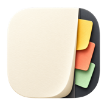
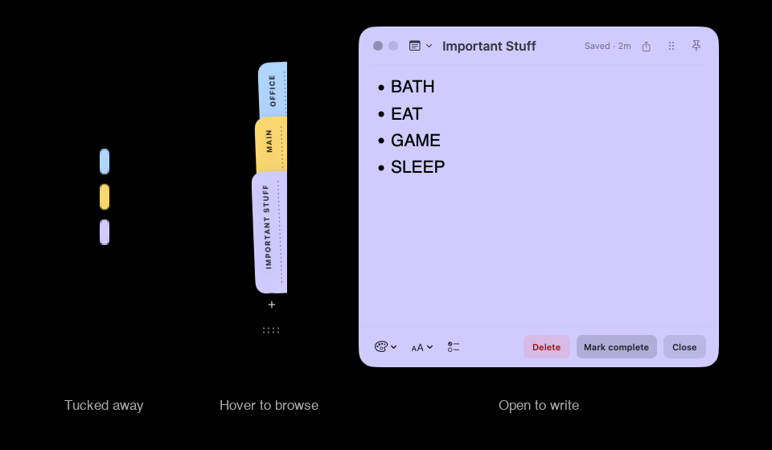
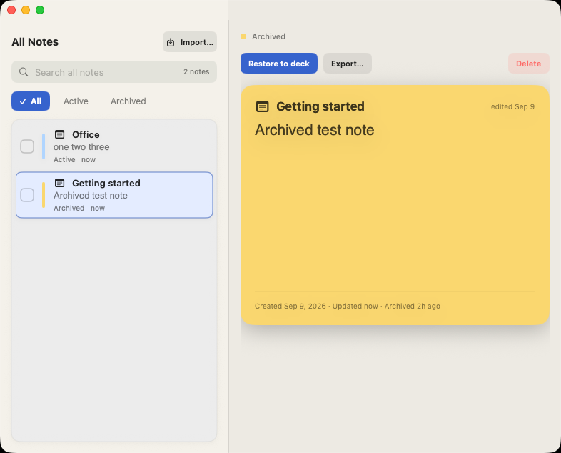

<p align="center">
  
</p>

<h1 align="center">Margin</h1>

<p align="center">
  <strong>Notes that live at the edge of your Mac.</strong><br>
  <sub>Keep a thought nearby. Pull it out when you need it.</sub>
</p>

<p align="center">
  <a href="https://github.com/valetivivek/Margin/releases/latest"></a>&nbsp;
  <a href="LICENSE"></a>&nbsp;
  &nbsp;
  
</p>

<p align="center">
  <a href="https://github.com/valetivivek/Margin/releases/latest"><strong>⬇ Download</strong></a> &nbsp;·&nbsp;
  <a href="#install">Homebrew</a> &nbsp;·&nbsp;
  <a href="CHANGELOG.md">Changelog</a> &nbsp;·&nbsp;
  <a href="https://github.com/valetivivek/Margin/issues">Issues</a>
</p>

<br>

<p align="center">
  
</p>

<br>


## ✦ Features

<div align="center">
<table>
  <tr>
    <td width="50%" valign="top" align="center">
      <h4>⌨️ Capture quickly</h4>
      Start a note with a keyboard shortcut — <kbd>⌥⌘N</kbd> by default.<br>
      No window shuffling. Just start typing.
    </td>
    <td width="50%" valign="top" align="center">
      <h4>✍️ Write comfortably</h4>
      Native bold, italic, headings, bullets,<br>
      checklists, and optional live Markdown formatting.
    </td>
  </tr>
  <tr>
    <td valign="top" align="center">
      <h4>📌 Keep things close</h4>
      Pin notes to your desktop. Open the built-in<br>
      calendar wing for events from iCloud, Google, and Exchange.
    </td>
    <td valign="top" align="center">
      <h4>🎨 Set your own style</h4>
      Pick note colors, interface accent, font, text size,<br>
      and light or dark appearance.
    </td>
  </tr>
  <tr>
    <td valign="top" align="center">
      <h4>🔒 Private by default</h4>
      No accounts, analytics, ads, or telemetry.<br>
      Note bodies encrypted locally — key stays in Keychain.
    </td>
    <td valign="top" align="center">
      <h4>📤 Share as Markdown</h4>
      Drag a card to Finder or use the share button<br>
      to export a <code>.md</code> copy. The original stays in Margin.
    </td>
  </tr>
</table>
</div>

<br>

## ✦ Install

**Homebrew** (recommended):

```sh
brew install --cask valetivivek/tap/margin
```

**Manual**: Download the latest [DMG](https://github.com/valetivivek/Margin/releases/latest) → drag **Margin** into **Applications**.

<br>

## ✦ All Notes

Search active and archived notes. Mark a note complete when you're done, restore it to the deck when you need it again, or export it to another app.

<p align="center">
  
</p>

<br>

## ✦ Keyboard shortcuts

Customize all bindings in **Settings → Shortcuts**.

| Shortcut | Action |
| :---: | :--- |
| <kbd>⌥⌘N</kbd> | Quick capture — new note |
| <kbd>⌥⌘L</kbd> | Open All Notes |
| <kbd>⌥⌘A</kbd> | Open Archive |
| <kbd>⌥⌘E</kbd> | Cycle deck edge (left → right → bottom) |
| <kbd>⌃⌥⌘H</kbd> | Hide / show all Margin windows |
| <kbd>⌘,</kbd> | Open Settings |
| <kbd>⌘W</kbd> | Close current window |

<br>

## ✦ Privacy & security

<div align="center">

🔐 **Encrypted locally** — note bodies and formatting are encrypted; the key never leaves macOS Keychain.

🚫 No accounts &nbsp;·&nbsp; No analytics &nbsp;·&nbsp; No ads &nbsp;·&nbsp; No telemetry

Titles and metadata are stored unencrypted. Exported files are readable by other apps.

---

<a href="PRIVACY.md"><kbd> Privacy </kbd></a>&nbsp;&nbsp;
<a href="SECURITY.md"><kbd> Security </kbd></a>&nbsp;&nbsp;
<a href="DATA-DELETION.md"><kbd> Data Deletion </kbd></a>&nbsp;&nbsp;
<a href="TERMS.md"><kbd> Terms </kbd></a>&nbsp;&nbsp;
<a href="THIRD-PARTY-NOTICES.md"><kbd> Third-Party Notices </kbd></a>

</div>


---

## Keeping Margin up to date

Check for updates in **Settings → About**, or with Homebrew:

```sh
brew update && brew upgrade --cask --greedy valetivivek/tap/margin
```

<br>

## Build from source

```sh
# Build a development copy (isolated settings, updates disabled)
./scripts/package-dmg.sh --build-only

# Build and install (quits the running app first)
./scripts/package-dmg.sh --install

# Package a universal DMG for distribution
./scripts/package-dmg.sh
```

The first build downloads [Sparkle](https://sparkle-project.org) automatically.

<br>

## Contributing

Contributions are welcome. Please keep changes focused and dependency-free where practical.

```sh
./scripts/package-dmg.sh --build-only
python3 scripts/check-build-workflow.py
```

<p align="center">
  <a href="CONTRIBUTING.md">Contributing</a> &nbsp;·&nbsp;
  <a href="docs/ARCHITECTURE.md">Architecture</a> &nbsp;·&nbsp;
  <a href="docs/RELEASING.md">Releasing</a> &nbsp;·&nbsp;
  <a href="https://github.com/valetivivek/Margin/issues">Report an issue</a>
</p>


