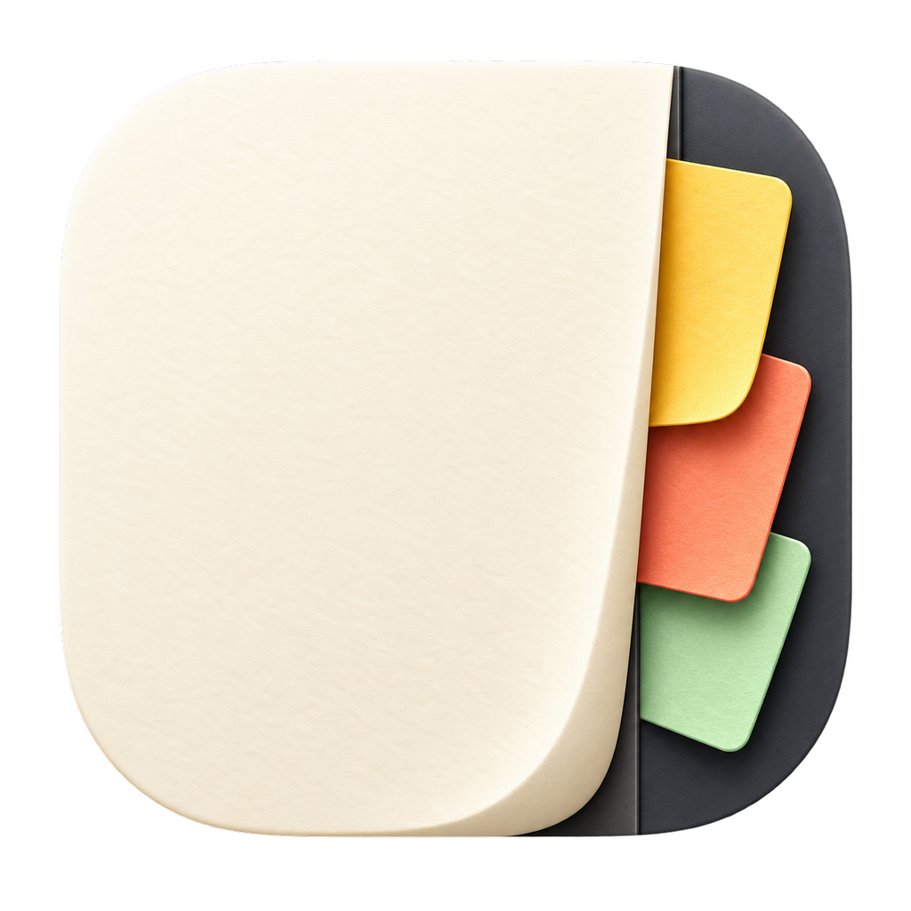

<p align="center">
  
</p>

<h1 align="center">Margin</h1>

<p align="center"><strong>Notes that live at the edge of your Mac.</strong></p>

<p align="center">
  A native, local-first sticky-note deck that stays close when you need it<br>
  and disappears when you do not.
</p>

<p align="center">
  <a href="https://github.com/valetivivek/Margin/releases/latest"></a>
  
  
  <a href="LICENSE"></a>
  <a href="https://github.com/valetivivek/Margin/actions/workflows/build.yml"></a>
</p>

<p align="center">
  <a href="https://github.com/valetivivek/Margin/releases/latest"><strong>Download the latest DMG →</strong></a>
</p>

---

## Why Margin?

| Always within reach | Private by default | Made for macOS |
| --- | --- | --- |
| Dock the deck on the left, right, or bottom edge and reveal it with the pointer. | Notes live in encrypted local storage, with the key protected by Keychain. | A lightweight native app with menu-bar mode, global shortcuts, and a universal binary. |

## Everything you need, nothing you do not

- **Fast capture** — press `⌥⌘N` from anywhere to create a note.
- **Edge deck** — hover for a preview, click to write, and drag to reorder.
- **Focused editor** — autosave, aligned checklists, automatic bullets, bold/italic and heading controls, Markdown formatting, clickable links, custom color tints, note icons, and pinning.
- **Full library** — search, archive, restore, import, and export your notes.
- **Calendar wing** — open a full month view, add synced events, choose its color, and drag it anywhere in the deck.
- **Your displays, your choice** — choose a connected display, the main display (default), or all displays.
- **Automatic updates** — receive signed releases automatically, or manage updates in **Settings → About**.
- **Markdown sharing** — drag a deck card to the Desktop or Finder to export it, or use the note’s Share button.
- **Quiet when needed** — keep Margin in the menu bar without a Dock icon.
- **Comfortable in any theme** — light by default, with system and dark appearances plus high-contrast selected states.

## Quick start

1. [Download the latest DMG](https://github.com/valetivivek/Margin/releases/latest).
2. Open it and drag **Margin** into **Applications**.
3. Control-click Margin and choose **Open** on first launch if macOS shows a security prompt.

Margin requires macOS 13 Ventura or newer.

## Shortcuts

| Shortcut | Action |
| --- | --- |
| `⌥⌘N` | Create a new note from anywhere |
| `⌥⌘L` | Open the complete note library |
| `⌥⌘A` | Open the Archive |
| `⌥⌘E` | Cycle the deck between left, right, and bottom |
| `⌃⌥⌘H` | Hide or show the deck and notes |
| `⌘,` | Open Settings, including from a note |
| `Esc` or `⌘W` | Save and close the current note |
| `⌘W` | Close All Notes, Archive, or Settings |
| `⌘B` / `⌘I` | Bold / italic in either editor mode |
| `⌘.` | Cycle the current note color |
| `⌘⌫` | Delete the current note |

Each shortcut can be enabled or disabled independently, and its binding and quick-capture action can be changed in **Settings → Keyboard**. Conflicting shortcuts are rejected; Escape cancels recording.

## Settings

Open **Settings** from the Margin menu-bar icon:

- **General** controls the screen edge, display, fan behavior, activation delay (0–1 second, default 50 ms), and animation speed.
- **Notes** controls Markdown formatting, preview delay, and whether the Share button appears.
- **Cloud Sync** is dimmed and unavailable in this build; background sync is paused.
- **Keyboard** configures shortcuts and the quick-capture action.
- **System** controls Dock / ⌘-Tab visibility, full-screen access (on by default), and note locking. Saved fullscreen choices are preserved; turning access off also hides the deck over Helium.
- **Appearance** offers light, dark, and system themes, five Settings accent colors, note typeface, text size, and new-note colors with a live preview. Existing preferences carry over automatically.
- **Calendar** controls the dedicated calendar wing, its color, account access, and which connected calendars appear.
- **About** shows the public app version and contains **Automatic updates** and **Check Now**.

Drag the dotted grip below **+** to slide the deck along an edge or move it to the left, right, or bottom of a display. An animated highlight previews a valid docking edge. Release elsewhere and it returns to its saved position. The collapsed activation strip is 12 points wide. Settings can be resized. An empty deck shows only **+**. Hold the left mouse button on a deck card and scroll to reorder it; scrolling also reorders during a note drag.

Settings use warm oyster surfaces and Satoshi typography, with an underline and selected states in your chosen accent. New notes keep rotating colors unless you choose a fixed color. **Show in Dock** is off by default. Enable it to include Margin in the Dock and ⌘-Tab.

Markdown is off by default. Normal editing supports bold, italic, headings, and checklists without switching into a Markdown preview. If you explicitly enable Markdown in Settings, notes open in Markdown preview. Click the body or begin typing to edit the plain source; formatting returns when the pointer leaves the note, focus moves elsewhere, or after an idle delay (5 seconds by default, adjustable from 1–60 seconds in Settings → Notes). Editing never hides characters or reparses Markdown on each keystroke. Headings (`#` through `######`), bold, italic, strikethrough, links, code, quotes, and tables receive formatting. Helvetica is the default note font. Checklist boxes remain clickable in preview. The editor scrolls in both modes with a slim native overlay scrollbar and uses macOS spelling correction and grammar suggestions. Exporting or sharing creates a copy named after the note, such as `Launch_plan.md`; the original stays in Margin.

Type `-` followed by Space at the start of a line to create a bullet. Enter continues the list; Enter again on the empty bullet ends it. Task lines retain their hanging indent while editing and in preview. The notes revealed when hovering over the deck are called **wings**.

Use the icon grid beside a note title to choose its symbol. The bottom toolbar contains color presets and an **Aa** formatting menu for selected text (Body and Heading 1–3). The custom color picker lives in **Settings → Appearance → New note color** and applies to new notes, with a live preview. Custom colors become soft note tints so dark text stays readable. **Settings → Appearance → Menu bar icon** offers a grid of six note-related symbols. Both icon grids show symbols without visible names.

With Markdown disabled, bold, italic, and selected text sizes use native rich text and persist in encrypted local storage. Sticky archives preserve this formatting, colors, and icons; plain-text and Markdown exports retain the text but do not carry native rich-text styling. Editing a note's Markdown source clears the separate rich-text formatting for that note; switching modes without editing retains it.

## Privacy

No account, analytics, advertising, or telemetry. Note bodies and formatting are encrypted on your Mac; titles and other metadata are not. Cloud Sync is unavailable in this build. Exported and shared Markdown files are readable by other apps.

Read the [Privacy Policy](PRIVACY.md), [License and Use Information](TERMS.md), [Data Deletion guide](DATA-DELETION.md), [Security Policy](SECURITY.md), and [Third-Party Notices](THIRD-PARTY-NOTICES.md).

## Build from source

Use the installed Apple developer tools and internet access on the first build. The build downloads a pinned, checksum-verified copy of Sparkle. Full Xcode is preferred; Command Line Tools can use its bundled macOS 26.5 SDK. Set `DEVELOPER_DIR` or `SDKROOT` to select another installed toolchain or SDK.

```sh
./scripts/package-dmg.sh --build-only
```

This compiles for this Mac, verifies the bundle, runs self-checks, and only then replaces `build/Margin.app`. Failed builds preserve the previous app; temporary builds are removed. Concurrent builds are rejected.

To build, verify, and update the one installed copy, quit Margin and run:

```sh
./scripts/package-dmg.sh --install
```

Open `/Applications/Margin.app` for normal use. Do not create separately named preview apps. Use `build/Margin.app/Contents/MacOS/Margin --ui-test --settings-test` for isolated UI checks; quit that process before installing.

For a universal release app and DMG, run `./scripts/package-dmg.sh` without arguments. To verify failed-build preservation, run `python3 scripts/check-build-workflow.py` after a successful build.

See [Architecture](docs/ARCHITECTURE.md), [Releasing](docs/RELEASING.md), and [Contributing](CONTRIBUTING.md).

## License

Margin is open source under the [MIT License](LICENSE).

### Calendar wing

Enable **Calendar wing** in **Settings → Calendar**, choose its color, and place it at the top, bottom, or anywhere between notes. Choose multiple calendars to display and one primary calendar for new events. Click the wing to open a movable, resizable full-month calendar styled like Margin. Use **New Event** or open a day and choose **Add event**; click an existing event to edit it, change its destination calendar, or delete it after confirmation. Margin sends these changes through EventKit and macOS handles provider sync.
